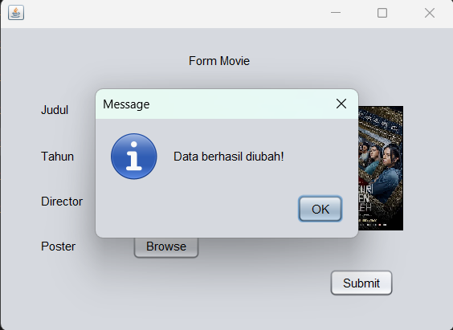

# TP2DPBO2023
Tugas Praktikum 2 Mata Kuliah Desain dan Pemrograman Berorientasi Objek. Program crud sederhana dengan java netbeans.

Saya Najma Qalbi Dwiharani dengan NIM 2102843 mengerjakan soal TP 2 dalam mata kuliah Desain dan Pemrograman Berorientasi Objek untuk keberkahanNya maka saya tidak melakukan kecurangan seperti yang telah dispesifikasikan. Aamiin.

### Catatan

- Screenshot ada di folder **doc**
- Jar ada di folder **dist**
- Images ada di folder **src/images**

## Desain Program

Program ini terdiri dari 3 kelas, yaitu:

### 1. User
#### Attributes
- id_user
- username
- password

### 2. Movie
#### Attributes
- id_movie
- title
- year
- id_director
- director_name
- poster

### 3. Director
#### Attributes
- id_director
- name
- nationality

Kelas Movie dan Director memiliki hubungan agregasi karena kelas Movie melalui atribut id_director pada kelas Movie.

## Alur Program

### 1. Login

  

Login memerlukan akun milik user yang tersedia pada database. Dalam program ini ada 2 user admin yang dapat mengakses program, yaitu:
  - username: admin -> password: 12345678
  - username: admin1 -> password: 87654321

-> Jika sukses login

    Jika berhasil login maka akan langsung menampilkan menu utama dengan list movie.

-> Jika gagal login

  

### 2. Menu Utama

-> Movie List

  

- Update Movie

    Jika menekan tombol *edit* maka akan berpindah ke form movie yang sudah terisi data dari movie yang ingin diubah.

  

  

    Setelah itu akan kembali ke halaman movie list.

  

- Delete Movie

    Jika menekan tombol *delete* maka akan diminta konfirmasi terlebih dahulu baru akan dihapus.

  
    
  

    Setelah itu akan kembali ke halaman movie list.

- Add Movie

    Jika menekan tombol *add new* maka akan berpindah ke form movie untuk mengisi data movie baru.

  

  

-> Director List

  

- Update director

    Jika menekan tombol *edit* maka akan berpindah ke form director yang sudah terisi data dari director yang ingin diubah.

  

  

    Setelah itu akan kembali ke halaman director list.

- Delete director

    Jika menekan tombol *delete* maka akan diminta konfirmasi terlebih dahulu baru akan dihapus.

  
    
  

- Add director

    Jika menekan tombol *add new* maka akan berpindah ke form director untuk mengisi data director baru.

  

  

### 3. Logout

Jika menekan tombol *logout* maka akan ada konfirmasi terlebih dahulu.

  

Jika *yes* maka akan kembali ke halaman login.

  